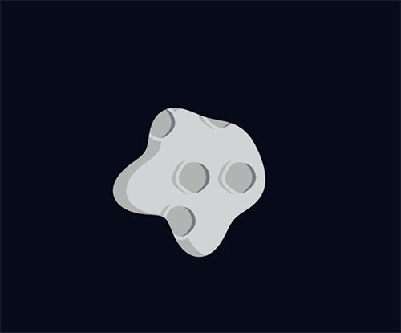
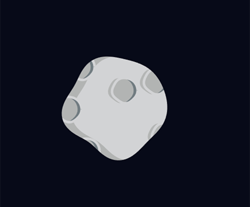

# Blob generator

Algorithm for blobby shapes generation (eg. asteroids, stones, ...).
Inspired by [this post](https://gamedev.stackexchange.com/questions/62613/need-ideas-for-an-algorithm-to-draw-irregular-blotchy-shapes/64266#64266).




## Usage

```js
const pointsArray = blob({
  // The number of points of the blob that should be returned.
  points: 360,
  // The radius of the blob if it was a perfect circle.
  radius: 25,
  // The number of waves the blob should have.
  totalWaves: 5,
  // The maximum weight of the waves. The bigger, the highest the waves will be, as if they were attracted outside the blob.
  maxWaveWeight: 0.15,
  // Weight of each wave. Should be between 0 and maxWaveWeight.
  weights: [
    0.22758758344096286,
    0.22914399498211835,
    0.48082074891715276,
    0.24720453139040366,
    0.8943967340103312
  ],
  // Starting angle of each wave around the circle, between 0 and 1.
  tetas: [
    0.5019172442558755,
    0.37216262597840677,
    0.42013817266713027,
    0.3662304499115392,
    0.7511340549973469
  ]
})
```
